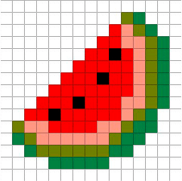

# Привет, мое имя Павел :wave:

Я фронтенд разработчик.
В  я осознал, что разработка интерфейсов доставляет мне удовольствие.

Помимо разработки я имею опыт управления проектами как в роли проджекта так и продукт менеджера, разбираюсь в диджитал маркетинге, могу быть аналитиком и тестировщиком. 
Все это дает мне возможность видеть код не только как разработчик. 

  

## Life

<!--
**paseek/paseek** is a ✨ _special_ ✨ repository because its `README.md` (this file) appears on your GitHub profile.

Here are some ideas to get you started:

- 🔭 I’m currently working on ...
- 🌱 I’m currently learning ...
- 👯 I’m looking to collaborate on ...
- 🤔 I’m looking for help with ...
- 💬 Ask me about ...
- 📫 How to reach me: ...
- 😄 Pronouns: ...
- ⚡ Fun fact: ...
-->
